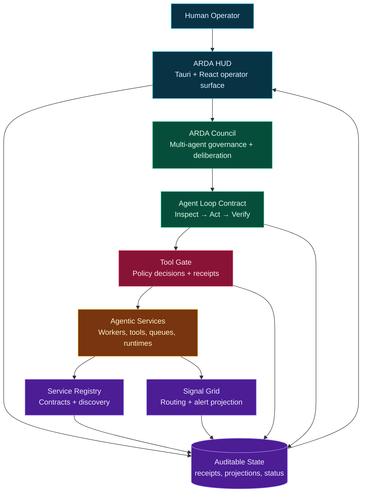

# ARDA

ARDA is the public map for the Annunimas agentic OS work: a set of small, inspectable repositories that define how autonomous agents register capabilities, route signals, deliberate governance choices, gate tool use, and expose operator-facing state.

The goal is not a single opaque agent runtime. The goal is a Bluefin-style operating surface for autonomous systems: immutable where it should be stable, inspectable where humans need evidence, and modular enough that contracts, policy gates, state projections, and UI surfaces can evolve independently.

## Vision

ARDA is the connective layer around Annunimas:

- local-first agent operations with explicit inspect-act-verify cycles;
- governance contracts before unchecked execution;
- deterministic receipts for tool-use decisions;
- service discovery and signal routing as auditable state surfaces;
- an operator HUD that makes system posture visible instead of hidden in logs;
- small Rust crates and focused UI surfaces that can be tested, reviewed, and reused.

The Bluefin/agentic OS direction is to treat the agent stack like an operating system distribution: stable contracts, governed updates, composable services, and a human-readable control plane for daily operation.

## Repository Map

| Repository | Role | Primary surface |
| --- | --- | --- |
| [Arda-Agent-Loop-Contract](https://github.com/dward1502/Arda-Agent-Loop-Contract) | Portable inspect-act-verify contract and validator | Agent operating-loop receipts |
| [Arda-tool-gate](https://github.com/dward1502/Arda-tool-gate) | Policy gate for autonomous tool invocation | Allow/deny/review JSON receipts |
| [Arda-Service-Registry](https://github.com/dward1502/Arda-Service-Registry) | Service discovery and governance registry blueprint | Service contracts and lifecycle status |
| [Arda-Signal-Grid](https://github.com/dward1502/Arda-Signal-Grid) | Governed signal routing blueprint | Communications, alerts, suppression, review routing |
| [Arda-Council](https://github.com/dward1502/Arda-Council) | Multi-agent deliberation and consensus blueprint | Governance and boardroom decision surfaces |
| [Arda-HUD](https://github.com/dward1502/Arda-HUD) | Operator-facing UI for Annunimas/ARDA state | Tauri/React control surface and 3D boardroom HUD |

## Architecture Overview



## Getting Started

1. Start with the operating loop contract:

   ```bash
   git clone https://github.com/dward1502/Arda-Agent-Loop-Contract.git
   cd Arda-Agent-Loop-Contract
   cargo run -- check examples/demo-config.toml examples/demo-cycle.json
   ```

2. Inspect tool-governance decisions:

   ```bash
   git clone https://github.com/dward1502/Arda-tool-gate.git
   cd Arda-tool-gate
   cargo run -- check examples/readonly-tool.metadata.json examples/readonly-tool.invocation.json
   ```

3. Explore the blueprint crates:

   ```bash
   git clone https://github.com/dward1502/Arda-Service-Registry.git
   git clone https://github.com/dward1502/Arda-Signal-Grid.git
   git clone https://github.com/dward1502/Arda-Council.git
   ```

4. Open the operator surface:

   ```bash
   git clone https://github.com/dward1502/Arda-HUD.git
   cd Arda-HUD
   npm install
   npm run build
   npm run test
   ```

## Design Principles

- Evidence first: every action should leave a receipt or state projection.
- Governance before mutation: execution paths should cross policy gates before changing state.
- Modular surfaces: contracts, gates, registries, signals, councils, and HUD views stay independently understandable.
- Local-first operation: demos and validators should work from local files before depending on hosted infrastructure.
- Human-operable autonomy: the system should expose enough context for a person to audit, pause, or redirect it.

## Status

ARDA is an active blueprint and implementation track. Some repositories are intentionally contract-first or blueprint-stage; that is part of the architecture. The system favors explicit boundaries and reviewable receipts over premature monoliths.
