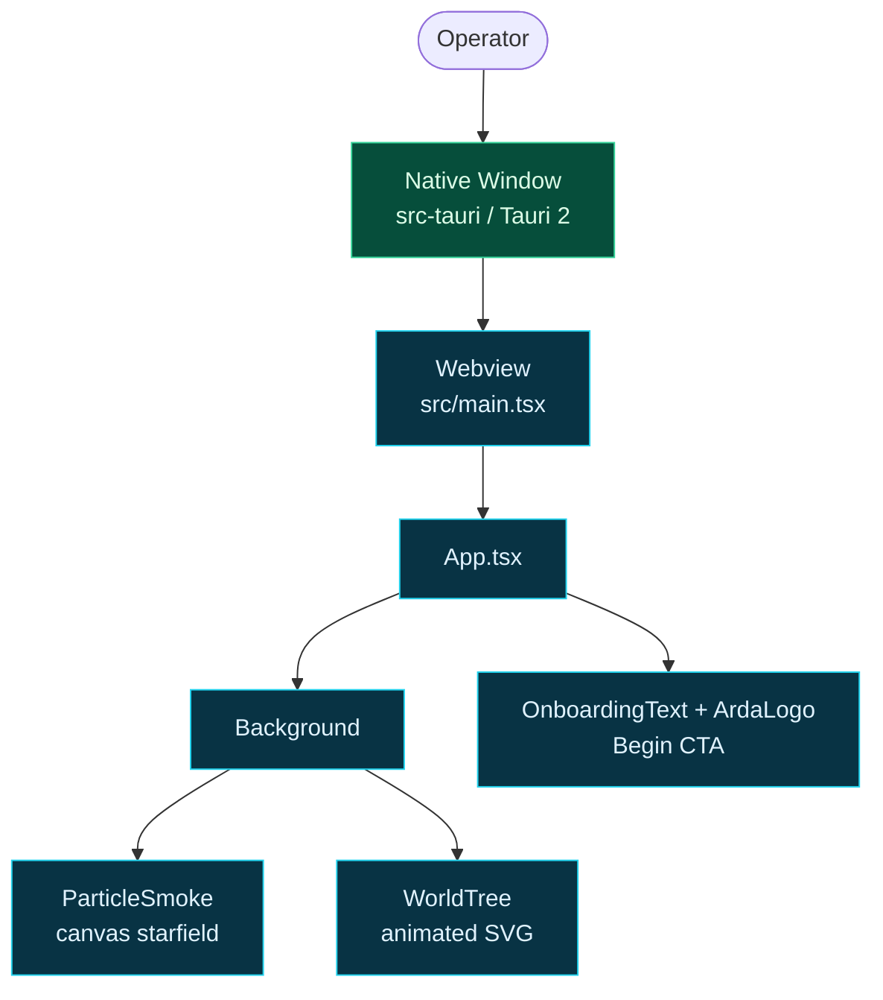

# arda-launcher

The **operator desktop launcher** for the ARDA ecosystem — the title screen of
the world. It is a Tauri 2 application with a React + TypeScript + Tailwind v4
frontend that renders a calm, atmospheric onboarding experience: a starfield, a
slowly growing world-tree, and a single **Begin** call to action.

This is the front door Arda provides. It currently stands alone, but it is the
surface that will eventually boot the operator into the surrounding ARDA services.

## Stack

| Layer | Technology | Notes |
| --- | --- | --- |
| Desktop shell | Tauri 2 | Rust + native webview; window, icon set, capability policy. |
| Frontend | React 18 + TypeScript | Vite dev server (port 1420, HMR on 1421). |
| Styling | Tailwind CSS v4 | `@tailwindcss/vite` plugin, no PostCSS config. |
| Language | TypeScript (`strict`) | `tsconfig` + `tsconfig.node.json` split. |

## Project Layout

```
apps/arda-launcher/
├── index.html              # Vite entry (mounts /src/main.tsx)
├── package.json            # scripts: dev / build / tauri
├── vite.config.ts          # Vite + React + Tailwind plugins
├── tsconfig.json           # app TS config
├── tsconfig.node.json      # config for vite.config.ts
├── src/
│   ├── main.tsx            # React root
│   ├── App.tsx             # composes the onboarding scene
│   ├── App.css             # unused legacy stylesheet (orphaned, safe to delete)
│   ├── index.css           # Tailwind entry: @import "tailwindcss";
│   ├── types/global.d.ts   # ambient typings (e.g. ImportMeta.env.DEV)
│   ├── components/
│   │   ├── ArdaLogo.tsx        # the ARDA badge/mark
│   │   ├── WorldTree.tsx       # animated SVG world-tree
│   │   ├── ParticleSmoke.tsx   # canvas particle/starfield animation
│   │   ├── OnboardingText.tsx  # title + subtitle + Begin CTA
│   │   └── Background.tsx      # full-bleed animated background shell
│   └── lib/
│       └── animation.ts        # easing + curve helpers shared by animations
└── src-tauri/
    ├── Cargo.toml          # Tauri app + plugin-shell deps
    ├── tauri.conf.json     # window, icons, build, bundle config
    ├── build.rs            # Tauri codegen (no extra schema)
    ├── capabilities/       # permission/capability JSON
    ├── icons/              # app icon set (referenced by tauri.conf.json)
    └── src/
        ├── main.rs         # Tauri entrypoint (run(), stable runtime)
        └── lib.rs          # builder: setup hook + plugin registration
```

> Note: `src/App.css` is an orphaned legacy stylesheet left over from the
> scaffold. It is not imported anywhere and can be deleted without effect.

## Components

- **Background** — full-viewport animated container that layers the particle
  field and world-tree behind the foreground text.
- **ParticleSmoke** — `<canvas>`-based particle/starfield animation driven by
  `lib/animation.ts` easing helpers.
- **WorldTree** — an animated SVG "tree of worlds" that grows/breaths on mount.
- **ArdaLogo** — the ARDA mark shown near the title.
- **OnboardingText** — the headline, sub-line, and the single **Begin** button
  that is the launcher's call to action.

## Getting Started

Prerequisites: Rust toolchain, Node 20+, and the Tauri 2 system libraries
(webkit2gtk-4.1, librsvg2, and build essentials).

```bash
cd apps/arda-launcher

# install frontend deps
pnpm install        # (or npm install)

# run the desktop app with hot-reload
pnpm tauri dev

# run the web frontend only (no native shell)
pnpm dev

# production web build
pnpm build

# bundle the desktop installer
pnpm tauri build
```

The Tauri dev window loads the Vite server at `http://localhost:1420`. Port and
HMR settings live in `vite.config.ts`; the window and bundle settings live in
`src-tauri/tauri.conf.json`.

## Architecture Overview



## Relationship to ARDA

`arda-launcher` is the operator-facing front door of the ARDA ecosystem. The
ARDA ecosystem map and reading order live in `crates/README.md` at the repo
root. The launcher is the first screen an operator sees before the surrounding
services (agent loop, tool gate, service registry, signal grid, council, HUD)
come online.

No planned shared `arda-core` Rust crate; shared types, if any, live in
dedicated workspace crates such as `engine` or `manwe`.

## Status

- Runnable: `pnpm tauri dev` launches the atmospheric onboarding scene.
- Visual experience implemented (background, particles, world-tree, logo, CTA).
- **Begin** CTA is a placeholder — not yet wired to live ARDA services.
- `src/App.css` is orphaned legacy CSS (delete-safe).
