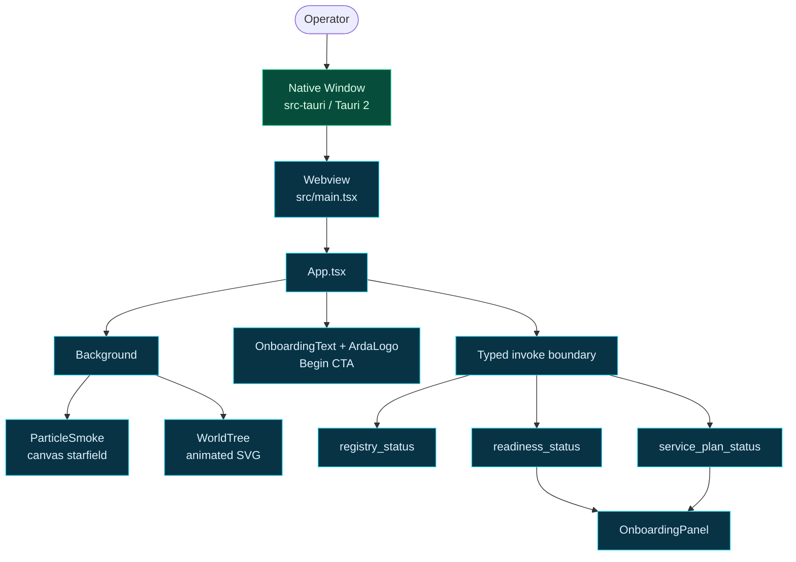

# arda-launcher

The **operator desktop launcher** for the ARDA ecosystem — the title screen of
the world. It is a Tauri 2 application with a React + TypeScript + Tailwind v4
frontend that renders a calm, atmospheric onboarding experience: a starfield, a
slowly growing world-tree, and a single **Begin** call to action.

This is Arda's read-only front door. The frontend invokes typed Tauri commands
for registry status, readiness projection, and the human-gated service plan. It
does not start services, write private configuration, or grant approval.

## Stack

| Layer | Technology | Notes |
| --- | --- | --- |
| Desktop shell | Tauri 2 | Rust + native webview; window, icon set, capability policy. |
| Frontend | React 19 + TypeScript | Vite dev server (port 1420, HMR on 1421). |
| Styling | Tailwind CSS v4 | `@tailwindcss/vite` plugin, no PostCSS config. |
| Language | TypeScript (`strict`) | `tsconfig` + `tsconfig.node.json` split. |
| Tests | Vitest | Tauri command-name, argument, and typed-payload contracts. |

## Project Layout

```
apps/arda-launcher/
├── index.html              # Vite entry (mounts /src/main.tsx)
├── package.json            # scripts: dev / test / lint / build / tauri
├── vite.config.ts          # Vite + React + Tailwind plugins
├── tsconfig.json           # app TS config
├── tsconfig.node.json      # config for vite.config.ts
├── src/
│   ├── main.tsx            # React root
│   ├── App.tsx             # registry gate + scene + onboarding projection load
│   ├── main.tsx            # React entry and stylesheet imports
│   ├── components/
│   │   ├── ArdaLogo.tsx        # ARDA badge/mark
│   │   ├── ParticleSmoke.tsx   # canvas particle animation
│   │   └── OnboardingPanel.tsx # readiness and human-gated plan projection
│   ├── scenes/             # background, world-tree, and onboarding text
│   └── lib/
│       ├── tauri-core-compat.ts      # typed command contract
│       └── tauri-core-compat.test.ts # command contract tests
└── src-tauri/
    ├── Cargo.toml          # Tauri app + opener/onboarding deps
    ├── tauri.conf.json     # window, icons, build, bundle config
    ├── build.rs            # Tauri codegen (no extra schema)
    ├── capabilities/       # permission/capability JSON
    ├── icons/              # app icon set (referenced by tauri.conf.json)
    └── src/
        ├── main.rs         # Tauri entrypoint (run(), stable runtime)
        ├── lib.rs          # command registration and Tauri builder
        └── onboarding/     # typed discovery/readiness/service-plan modules
```

## Components

- **Background** — full-viewport animated container that layers the particle
  field and world-tree behind the foreground text.
- **ParticleSmoke** — `<canvas>`-based particle/starfield animation driven by
  `lib/animation.ts` easing helpers.
- **WorldTree** — an animated SVG "tree of worlds" that grows/breaths on mount.
- **ArdaLogo** — the ARDA mark shown near the title.
- **OnboardingText** — the headline, sub-line, and the single **Begin** button
  that is the launcher's call to action.
- **OnboardingPanel** — accessible, read-only rendering of readiness and service
  plan output; human-gated actions remain visibly marked.

## Command surface

`src-tauri/src/lib.rs` registers exactly three commands:

| Command | Result | Authority |
| --- | --- | --- |
| `registry_status` | Registry load/gate status and track count | Read-only |
| `readiness_status` | Environment-derived readiness projection | Read-only |
| `service_plan_status` | Proposed service actions and human-gate metadata | Proposal only |

The frontend wrapper in `src/lib/tauri-core-compat.ts` pins command names,
arguments, and serialized response shapes. No sample `greet` command remains.

## Getting Started

Prerequisites: Rust toolchain, Node 20+, and the Tauri 2 system libraries
(webkit2gtk-4.1, librsvg2, and build essentials).

```bash
cd apps/arda-launcher

# install frontend deps
pnpm install        # (or npm install)

# run the desktop app with hot-reload
pnpm tauri dev

# run the web frontend only (no native shell)
pnpm dev

# production web build
pnpm build

# frontend contract tests and lint
pnpm test
pnpm lint

# bundle the desktop installer
pnpm run tauri build
```

The Tauri dev window loads the Vite server at `http://localhost:1420`. Port and
HMR settings live in `vite.config.ts`; the window and bundle settings live in
`src-tauri/tauri.conf.json`.

## Architecture Overview



## Relationship to ARDA

`arda-launcher` is the operator-facing front door of the ARDA ecosystem. The
ARDA ecosystem map and reading order live in `crates/README.md` at the repo
root. The launcher is the first screen an operator sees before the surrounding
services (agent loop, tool gate, service registry, signal grid, council, HUD)
come online.

The launcher depends on `arda-core` for canonical governance types and on
`arda-contract-registry` for registry checks. Manwe endpoint values come from
`MANWE_BASE_URL` or `ARDA_MANWE_BASE_URL`; this app does not hardcode `:7171`.
The workspace's existing `:7171` default remains a coordinated compatibility
contract and must not be changed from this leaf app alone.

## Status

- Packet 7 complete locally on 2026-07-29.
- **Begin** loads typed readiness and service-plan projections into an accessible
  read-only panel; backend errors are shown instead of discarded.
- Fourteen Rust launcher tests and eleven frontend contract/orientation tests pass.
- Strict Rust gates, frontend lint/test/build, release binary, DEB, and RPM pass.
- Frontend, Cargo, and Tauri bundle metadata are aligned at version `0.3.0-rc.2`.
- Linux packaging sets `NO_STRIP=true` for Tauri's cached `linuxdeploy`, whose
  old bundled `strip` cannot read modern `.relr.dyn` sections. AppImage, DEB,
  and RPM assembly pass through the normal `pnpm run tauri build` entry point.
