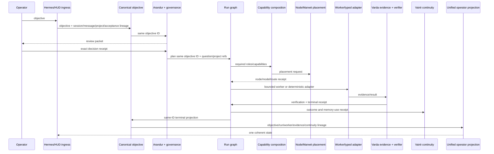

---
soterion:
  sigil: "SCROLL"
  glyph: "📜"
  code_point: "U+1F4DC"
  role: "current_flow_audit"
  owner: "PROMETHEUS"
  status: "active"
  reviewed: "2026-08-21"
---

> 🜏 Soterion: 📜 current_flow_audit | owner: PROMETHEUS | status: active | reviewed: 2026-08-21

# Digital Organism Current Objective Flow Trace

Task: `digital-organism-s0-current-flow-trace`

Program: [`../plans/digital-organism/README.md`](../plans/digital-organism/README.md)

Foundation matrix: [`digital-organism-foundation-matrix.md`](digital-organism-foundation-matrix.md)

Machine trace: `../../.hermes/evidence/digital-organism/current-flow-trace.json`

Repository baseline: `fd804c55`

## Verdict

The current selected operator objective and the current economic-intelligence run are separate lineages.

The selected canonical objective, `operator-objective-78370a00190fd9b8`, is correctly preserved by the queue, selected by next-action, and blocked by Arandur for explicit review. It has never entered project attachment, approval, planning, worker composition, Manwë placement, Varda evidence, Vairë memory, or execution receipts. Its source says only `operator-authored-session-objective`; no Hermes session, platform message, Oromë operator event, project, task/run, or acceptance-criteria reference survives.

The current run, `phase5-economic-intelligence-eaeb4d61fb78`, was created manually under a separate phase objective and approval ID. It has produced useful Warden/Varda evidence, but its `research` node has no worker contract and remains pending. Research runs through a side path—harness → Warden discovery → Varda fetch/evaluation → `EvidenceLinked`—that never invokes Hermes/Manwë worker placement and intentionally never transitions the node. No terminal execution receipt, output digest, recovery token, local Vairë memory-use record, or queue terminal lineage exists.

The operator surfaces are individually honest but not cohesive:

- Personal Operations/next-action shows the selected queue objective.
- Operator projection shows the unrelated phase run as active/pending and its evidence.
- Research workspace shows the current advisory brief and question.
- Continuity is stale/inactive and references none of those IDs.

The user therefore sees three truthful partial stories rather than one organism objective.

## Scope and direct evidence

This audit traced:

- canonical queue and latest-by-ID task lifecycle;
- authenticated `arda.next-action.v1`;
- fresh `arda.arandur.objective_selection.v1` state;
- Oromë operator-session ledger and Hermes bridge recognition/forwarding;
- research question registry, run checkpoint/journal, research brief, Warden/Varda receipts;
- engine run planning, provider execution, and evidence-link source paths;
- local Vairë/Mnemosyne stores for correlated IDs;
- continuity and operator projections;
- HUD Personal Operations, Research, Workbench, and operator-projection consumers;
- the originating Hermes session as secondary historical context.

No source or runtime state was repaired in Task 2.

## Actual flow A — selected canonical objective

```mermaid
sequenceDiagram
    participant U as Operator
    participant H as Hermes CLI session
    participant Q as Canonical queue
    participant N as Next action
    participant A as Arandur read-only cycle
    participant R as Run/worker system

    U->>H: broad core-Arda audit and repair intent
    H-->>Q: objective appended outside gateway bridge
    Note over H,Q: Hermes session/message ID not retained
    Q->>N: operator-objective-78370a00190fd9b8
    N-->>U: selected; review_required
    Q->>A: review-gated candidate packet
    A-->>U: no selection; explicit approval required
    A-xR: no approval packet, plan, run, worker, route, or receipt
```

### Stage evidence

| Stage | Durable authority | Correlation preserved | Correlation lost | Current outcome |
|---|---|---|---|---|
| Operator intent | prior Hermes CLI session | human narrative only | live session/message IDs | historical context only |
| Queue append | `core/projects/tasks/queue.jsonl` | queue objective ID, owner, priority, review metadata | session, message, project, acceptance criteria | durable pending objective |
| Next action | `core/state/next_action.json` | same queue objective ID and source ref | none from available input | selected for operator review |
| Arandur selection | `data/ceo/autopilot.state.json` | source/candidate ID and review gate | detail/constraints/success criteria are not represented in `Objective` | blocked; zero objectives selected |
| Execution | none | none | approval packet, run, worker, route, evidence, receipt | never entered |

### Why Hermes ingress is not proven for this objective

The enabled plugin recognizes natural project objectives only in private Discord language shaped as `for project <UUID>, ...`; it forwards a normalized explicit command to `/v1/operator/messages`. The backend then requires an attached project and appends a project task with platform-message/capture lineage.

The selected objective has no project ID and no matching Oromë operator-session row. Session history shows the operator authored the intent in the CLI audit session, but the canonical queue record does not preserve that session. Therefore the objective is operator-authored and current, but not a proven Hermes Gateway → Oromë → queue handoff.

## Actual flow B — current economic-intelligence research run

```mermaid
sequenceDiagram
    participant U as Operator/phase work
    participant G as Run graph
    participant Q as Research question registry
    participant W as Warden scout
    participant V as Varda
    participant J as Run journal
    participant M as Vairë
    participant P as Operator projection/HUD

    U->>G: Planned(run, project, operator-phase5-begin)
    U->>Q: durable bounded question
    Note over G,Q: no shared objective/session/message reference
    G-->>G: research node remains pending; no worker contract
    U->>W: /v1/research/brief side path
    W-->>V: discovered sources + remote memory receipt
    V-->>J: brief + EvidenceLinked event
    Note over J,G: evidence append does not transition node
    J-xM: no local memory-use/continuation receipt
    J-->>P: pending run + current evidence
    Q-->>P: question/brief via separate Research API
```

### Preserved lineage

The latest brief preserves:

- run: `phase5-economic-intelligence-eaeb4d61fb78`;
- node: `source-grounded-research`;
- question: `8011c200-6743-4816-b100-c6f56e71da69`;
- brief: `research-497ea63fae507a8b`;
- two Varda source/pipeline/crawl/evaluation identities;
- remote Warden memory receipt `mem_6853c963e27247bfac617231c64a50f0`;
- advisory authority and `execution_authorized=false`.

### Missing lineage

The run/question/evidence family does not preserve:

- selected queue objective ID;
- Hermes session or platform message ID;
- canonical approval packet with identity/scope/absolute expiry;
- worker role/ID or placement route;
- Manwë provider/model route;
- engine/Hermes execution receipt;
- output digest;
- terminal node transition;
- local Vairë memory-use or continuation receipt;
- queue terminal record.

## Why the research node remains pending

The current journal contains nine events:

- one `planned`;
- eight `evidence_linked`;
- zero node transitions.

`create_brief` opens the existing run/node, calls Warden `/discover`, fetches and evaluates sources through Varda, writes the brief atomically, and appends `RunEventKind::EvidenceLinked`. The evidence append carries advisory authority and a digest but does not mutate `NodeState`.

This is internally consistent. It is also incomplete as an organism workflow because no verification/convergence rule says when enough evidence permits a research node to become succeeded, failed, blocked, or awaiting review.

The generic Hermes provider path cannot close this node. `execute_provider_node` accepts only `NodeKind::Execute` or `NodeKind::Verify`; the current node is `NodeKind::Research`. It also has no worker contract. The current research execution therefore bypasses worker admission, placement receipts, Hermes, and Manwë by design.

## Authority and receipt map

| Concern | Current minting authority | Durable append/store | Current consumer | Status |
|---|---|---|---|---|
| Operator objective | direct/session-derived queue append | canonical queue JSONL | next-action, Arandur | durable; ingress correlation incomplete |
| Arandur review packet | full-CLI autopilot | `data/ceo/autopilot.state.json` projection | HUD/status/operator | review gate works; no selection |
| Run identity | harness `/v1/runs/plan` | run journal + checkpoint | operator projection, HUD Workbench | separate objective lineage |
| Research question | harness research operator | `data/workbench/research/questions.json` | next-action, HUD Research | durable; no objective/run refs |
| Source evidence | Varda research path | brief JSON + Athena receipts | operator projection, HUD Research | strong advisory evidence |
| Evidence/run link | RunStore `EvidenceLinked` | run journal | operator projection | append-only, non-terminal |
| Remote memory | Warden scout | remote Warden memory | brief receipt refs | evidence-node memory only |
| Organism memory | Vairë | no correlated record found | none | missing |
| Worker route | none for this run | none | none | missing |
| Execution outcome | none | none | operator projection | missing; node stays pending |
| Communications | Hermes/Oromë for gateway events | operator-session and continuity ledgers | operator projection currently empty | selected objective/run not linked |

Execution evidence and approved knowledge remain correctly separate: the advisory brief cannot authorize action or automatically become Vairë knowledge. The missing step is an explicit evaluation/use/terminal lineage, not indiscriminate memory promotion.

## Correlation breaks

| ID | Boundary | Severity | Finding |
|---|---|---:|---|
| B1 | Hermes/CLI intent → queue | High | session and message identity are not retained |
| B2 | Queue → Arandur packet | Medium | ID survives; detail, constraints, and success criteria collapse |
| B3 | Queue objective → run graph | Critical | no run references the selected queue objective |
| B4 | Research question → run graph | High | linkage appears only in later briefs, not either originating authority |
| B5 | Research node → placement | Critical | no worker; research kind cannot use provider executor |
| B6 | Evidence → terminal run | Critical | evidence events never produce verification or node convergence |
| B7 | Warden/Varda → Vairë | High | remote memory receipt exists; organism memory-use/continuity does not |
| B8 | Backend → operator surfaces | High | three surfaces expose different objective universes |
| B9 | Continuity → current work | Medium | continuity is stale/inactive with no action or commitment refs |

## Current HUD behavior

The HUD does not fabricate these states:

- Personal Operations calls authenticated `/v1/next-action` and displays the queue objective.
- Research calls `/v1/research/questions`, `/watchlists`, and `/briefs` and shows the current brief as advisory-only.
- The core bundle reads `core/state/operator_projection.json`; the monitor renders its run/objective IDs.
- Workbench controls call the exact run APIs.

The problem is not that the HUD invents a result. It faithfully displays incompatible backend lineages. The existing operator projection derives objectives only from registered current run graphs, so it cannot include the selected queue objective unless a run shares that ID or the projection explicitly joins queue objectives.

## Intended cohesive organism flow



## Smallest alignment decisions for Task 3

Task 3 should decide authority and transport boundaries, not implement the whole intended flow.

1. Make the canonical queue objective ID the parent identity for run `objective_id`; phase labels may remain tags, not replacement IDs.
2. Define one bounded objective envelope carrying session/message/project/acceptance refs without copying transcripts.
3. Decide whether research is a deterministic typed adapter, a first-class worker kind, or both with an explicit lifetime rule. It must emit placement/execution identity even when no LLM is used.
4. Define evidence convergence: required evidence → verifier/review → explicit terminal transition. `EvidenceLinked` alone remains non-terminal.
5. Keep remote Warden memory and canonical Vairë distinct; add a Vairë use/continuation receipt only after governed evidence consumption.
6. Make one operator projection join queue objective, run, worker/route, question, evidence, continuity, and task terminal records by canonical objective ID.
7. Preserve existing authorities: no new queue, memory store, research ledger, approval system, or UI truth source.

## Acceptance result

Focused verification passed:

- 21 backend tests across next-action, operator gateway intake, research restart, and operator projection;
- 13 HUD tests across Research, Personal Operations/next-action, and operator projection parsing/signals;
- live harness reads for the selected next action, current run and journal, question, brief, continuity projection, and operator projection;
- machine-trace schema, stage ordering, nine break IDs, cited repository paths, Markdown links, diagrams, secret scan, and diff hygiene.

Task 2 acceptance is technically satisfied:

- actual selected-objective and current-research sequences are separately documented;
- intended organism sequence is documented;
- every observed handoff identifies its authority and preserved/lost IDs;
- manual side paths and dead ends are explicit;
- no repair, transition, approval, memory promotion, or execution was fabricated.

Stage 0 remains open. Stage 1 remains blocked pending Task 3’s accepted ownership/transport map.

## Next task

`digital-organism-s0-authority-transport-map` — select the canonical owners and projection rules for objective, session, node, agent, task/run, semantic envelope, A2A wire, memory, placement, approval, evidence, terminal receipts, and UI state.
