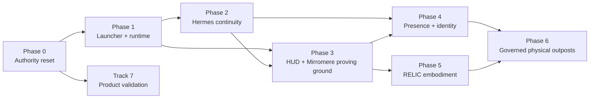

---
soterion:
  sigil: "SCROLL"
  glyph: "📜"
  code_point: "U+1F4DC"
  role: "program_plan"
  owner: "PROMETHEUS"
  status: "active"
  reviewed: "2026-08-17"
---

> 🜏 Soterion: 📜 program_plan | owner: PROMETHEUS | status: active | reviewed: 2026-08-17

# Arda Ambient Agent Program

> **For Hermes:** Use the `subagent-driven-development` skill to execute one work packet at a time. Never infer completion from this plan; prove each gate from source, runtime, native UI, and genuine use as specified.

**Goal:** Build a persistent personal agent relationship that begins in Hermes and continues across desktop, phone, HUD, Mirromere, RELIC, and governed physical outposts.

**Architecture:** Hermes remains the primary conversational and agentic runtime. Arda supplies continuity, durable intent, Vairë memory, Varda research governance, risk classification, device identity, presence, receipts, and cross-surface orchestration. Deterministic services supervise processes; agents issue typed governed intents rather than raw device commands.

**Tech stack:** Hermes Agent, Rust, Tokio/Axum, Tauri 2, React 19, TypeScript, Three.js/react-three-fiber, systemd user services, versioned JSON/Serde contracts, Linux desktop entries, authenticated outpost transport.

---

## 1. Product thesis

Arda is not another agent harness and not a general-purpose dashboard. It is a bespoke ambient and embodied agent system for one sovereign operator. Its differentiating value is continuity: one governed relationship can remember durable objectives, survive model/session/surface changes, research new interests without displacing commitments, and act through physical or digital capabilities without silently expanding authority.

The visible embodiments are:

- **Arda Launcher:** deterministic ignition, recovery, and source-truth status.
- **Arda HUD:** desktop command environment and in-world proving ground.
- **Mirromere:** calm room-scale ambient assistant and application host.
- **RELIC:** read-only spatial visualization of receipt-backed agent flow.
- **Outposts:** enrolled displays, sensors, printers, robots, and future devices.

The current `arda-hud` boardroom and the operator's second monitor are the first Mirromere proving ground. A presentation contract must drive both an in-world HUD aperture and a native second-monitor surface so the work validates the future mirror without turning the HUD World View into an operator workspace.

## 2. Non-negotiable authority boundaries

1. Hermes is the primary agent/session/tool/gateway runtime. Arda must not reduce it to a disposable CLI subprocess for the main operator relationship.
2. Vairë owns provenance-aware continuity and memory policy.
3. Varda owns research, evidence comparison, epistemic disposition, and governed knowledge adoption.
4. Durable intent and task authority remain external to model context; curiosity cannot silently replace commitments.
5. Personal and business data/action authority remain separately governed with explicit overlap.
6. systemd and deterministic Rust code own process supervision, health, restart, and fail-safe behavior. An LLM is never the watchdog keeping itself alive.
7. Presence is not identity; identity is not authorization; authorization is not execution proof.
8. Consequential actions require scoped approval and durable receipts.
9. RELIC and ambient projections cannot invent activity. Missing, stale, projected, and unavailable remain visible states.
10. Raw camera/audio/biometric material stays local to the outpost wherever possible. Only bounded, expiring derived claims cross the boundary.
11. Every outpost has local safety, privacy, degraded behavior, revocation, and physical shutdown controls.
12. Tests, plans, screenshots, and self-authored receipts are not genuine operator acceptance.

## 3. Program dependency graph

Phases 0 and 1 are closed. Phase 1's accepted launcher/runtime evidence is
retained in the [operations record](../../operations/launcher-local-runtime-acceptance.md)
and [archived implementation plan](../../archive/2026-08-17-launcher-local-runtime-plan.md).
Later implementation phases remain open until their explicit gates pass.

## 4. Segment plans

| Phase | Plan | Primary result | Depends on |
|---|---|---|---|
| 1 | [Launcher and Local Runtime — complete](../../archive/2026-08-17-launcher-local-runtime-plan.md) | Restart, click icon, prove services, open HUD | Phase 0 |
| 2 | [Hermes Continuity and Surface Handoff](02-hermes-continuity-handoff.md) | Same governed conversation continues across phone/desktop/room | Phase 1 |
| 3 | [HUD and Mirromere Proving Ground](03-hud-mirromere-proving-ground.md) | One presentation contract renders in HUD aperture and second-monitor native surface | Phases 1–2 |
| 4 | [Presence, Identity, and Privacy](04-presence-identity-privacy.md) | Multi-signal local presence safely prepares/resumes context | Phases 2–3 |
| 5 | [RELIC Runtime Embodiment](05-relic-runtime-embodiment.md) | Physical display truthfully renders agent flow | Phases 1 and 3 |
| 6 | [Governed Physical Outposts](06-governed-physical-outposts.md) | Typed proposal/approval/execution protocol for devices | Phases 4–5 |
| 7 | [Product Validation and Commercialization](07-product-validation-commercialization.md) | Current competitive evidence, observed user value, and paid-commitment tests | Runs alongside proven slices |
| All | [Workstream and Branch Map](WORKSTREAMS.md) | Non-overlapping agent packets and integration order | This index |

## 5. Minimum credible vertical slices

### Slice A — ignition

After a real restart, the operator clicks one installed Arda icon. Launcher reports source-truth startup state, starts the allowlisted local target, waits for real health, and opens the native HUD. Launcher may close or remain as status without owning child process lifetime.

### Slice B — continuity

The operator speaks to Hermes on the phone, later opens desktop/HUD, and resumes the same authenticated session with durable commitments and relevant Vairë context. No copy/paste, synthetic reconstruction, or re-explanation is required.

### Slice C — embodiment

A typed Mirromere scene/application document renders both inside an ARDA HUD aperture and on the physical second monitor. Source truth, privacy, accessibility, and degraded state are identical across both consumers.

### Slice D — arrival

An enrolled local presence signal prepares Mirromere. Combined identity evidence permits a personalized greeting. Explicit operator action transfers the active Hermes conversation to the room. Presence alone cannot expose sensitive content or authorize consequential work.

### Slice E — spatial runtime

RELIC renders fresh receipt-backed agents, delegation, waits, approvals, failures, and handoffs. Disconnect or expiry visibly becomes `idle_degraded`; scripted activity cannot masquerade as live state.

### Slice F — physical action

A simulated 3D printer advertises capabilities. Hermes proposes a job, Arda classifies it, the operator approves the exact artifact and parameters, the outpost executes once, and a terminal receipt records the result. Duplicate, expired, unauthorized, or altered requests fail closed.

## 6. Program evidence ladder

Use these maturity labels exactly:

| Level | Meaning | Minimum evidence |
|---|---|---|
| Documented | Requirement/contract written | Reviewed tracked document |
| Implemented | Source path exists | Diff and compile/typecheck |
| Tested | Deterministic behavior exercised | Focused tests with expected failure/pass |
| Wired | Production constructor/call path reaches it | Source trace and integration test |
| Running | Installed service/window/endpoint is live | Immediate process/unit/listener/native evidence |
| Proven | End-to-end scenario succeeds after restart/failure | Recorded bounded acceptance run |
| Used | Operator completed representative work | Genuine-use record, not agent simulation |
| Supported | Reproducible artifact and recovery contract | Exact bytes, install/upgrade/rollback evidence |

No lower level may be phrased as a higher one.

## 7. Shared contracts to establish before parallel implementation

These are schema responsibilities, not permission to create duplicate authorities:

- `arda.system-lifecycle.v1`: required components, lifecycle, health, source truth, recovery action, observation time.
- `arda.surface-handoff.v1`: authenticated session lineage, source/destination surface, privacy class, consent, context refs, expiry.
- `arda.mirromere.surface.v1`: scene/application identity, slots, content refs, provenance, privacy, accessibility, validity window, interaction policy.
- `arda.operator-presence.v1`: bounded derived signals, confidence, factor classes, TTL, room/outpost, privacy and authorization ceiling.
- Existing `arda.runtime-presence.v1`: remain the RELIC read-only operational projection.
- `arda.outpost.manifest.v1`: identity, software, capabilities, authority class, retention, calibration, local safety controls.
- `arda.outpost.intent.v1`: typed requested outcome, artifact/parameter digests, authority class, approval requirement, expiry, compensation.
- `arda.outpost.execution-receipt.v1`: accepted/rejected/executed state, exactly-once key, observed result, error, device identity, timestamps.

Schemas must use `deny_unknown_fields` or equivalent strict parsing, explicit versions, bounded payloads, expiry, and deterministic test fixtures.

## 8. Cross-cutting acceptance requirements

Every phase must include:

- focused RED/GREEN tests before implementation;
- strict unknown/stale/unavailable behavior;
- production call-path evidence, not constructor presence alone;
- bounded logs without secrets or raw biometrics;
- cancellation/restart behavior;
- exact verification commands and expected results;
- source-truth status in every UI;
- keyboard/accessibility and reduced-motion handling where visual;
- native window or physical display evidence where the claim is native/physical;
- a genuine operator scenario before marking `proven` or `used`;
- documentation reconciliation after runtime verification, not before.

## 9. Complexity budget

Do not begin with fleet-wide orchestration, opaque continual model training, medical inference, unrestricted smart-home control, humanoid robotics, payments, or autonomous physical motion. The initial implementations are:

- one operator;
- one workstation;
- one Hermes identity/session lineage;
- one second-monitor Mirromere surface;
- one CITADEL/RELIC read-only renderer;
- one simulated printer before real actuation;
- local-first data and explicit remote boundaries.

Expansion occurs only after the prior vertical slice survives restart, disconnect, stale data, and operator use.

## 10. Program completion

The program is not complete merely because all six plan files are checked. Completion requires:

1. ignition works after a real restart without terminal use;
2. Hermes conversation continuity works phone-to-desktop-to-room;
3. HUD and second-monitor Mirromere consume the same governed surface contract;
4. presence and privacy boundaries survive false/expired/missing signals;
5. RELIC displays real flow and degrades honestly;
6. one physical-action class completes proposal → approval → exactly-once execution → terminal receipt;
7. the operator uses the system repeatedly and chooses to keep it running;
8. active docs match installed reality.

Commercial completion is evaluated separately: the project must not claim
novelty, demand, or a scalable offer beyond the evidence ladder in Track 7.
